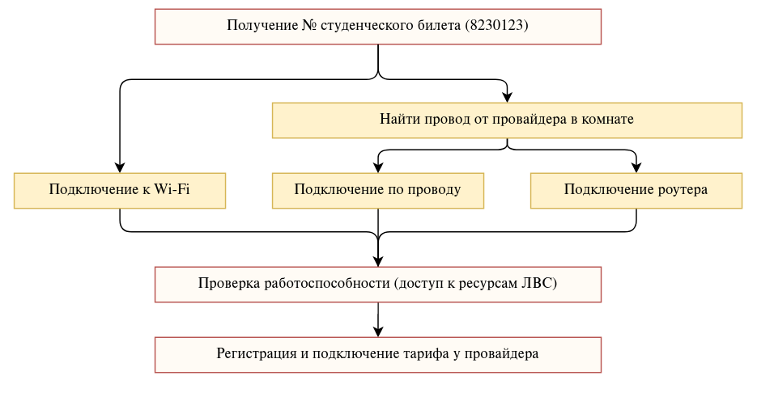

# Подключение к ЛВС. Начало

## Учетная запись МИЭТ

Для подключения к сети используется учётная запись МИЭТ. Она имеет вид __823$$$$__ (для поступающих в 2023 году). Она используется для входа в ОРИОКС, поэтому часто называется логином ориокса. А так - это номер студенческого билета и номер на пропуске.

Для подключения к сети требуется вводить именно _логин и пароль_ от учётной записи МИЭТ.

## Первичное подключение

Чтобы зарегистрироваться у провайдера и подключить интернет, необходимо сначала успешно подключиться к локальной сети. Это можно сделать тремя способами:

* [Подключение с использованием роутера](./2-router.md)
* [Беспроводное подключение к MIET-DP](./2-wireless.md)
* [Проводное подключение Ethernet](./2-wired.md)

Провайдер имеет ограничения на количество подключаемых устройств с доступом в Интернет, поэтому проще всего сразу настроить роутер. Роутер обходит эти ограничения. 

Роутер можно настроить и позже - для этого в инструкциях есть специальный раздел.

Проводное подключение вызывает больше всего трудностей и не рекомендуется в принципе.

## Что будет дальше

После настройки роутера или подключения к локальной сети напрямую будут доступны ресурсы ЛВС (локальной вычислительной сети). Это, например, ОРИОКС, удаленные рабочие столы и так далее.

Если они доступны, можно будет регистрироваться у провайдера.