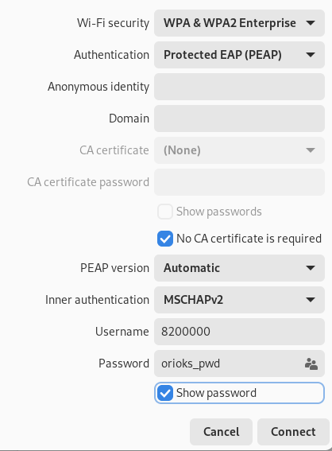

# Беспроводное подключение

В студгородке имеются точки доступа MIET-DP. К ним можно подключиться в случае отсутствия патчкорда или Ethernet разъема.

Настройки аналогичны проводному.

На андройде обычно вот так:

* Метод EAP: PEAP
* 2-й этап аутентификации: MSCHAPv2
* Сертификат центра сертификации: не проверять
* Подлинность/Identity: 8230000
* Анонимная подлинность/Anonymous Identity: пусто
* Пароль: orioks_pwd

Рекомендуется отключать рандомизированный MAC адрес (выбрать "MAC адрес устройства" в дополнительных параметрах подключения), иначе телефон перестанет подключать после 3 попытки.

[Следующий шаг: Проверка подключения](./3-check.md)