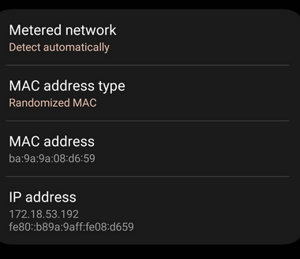
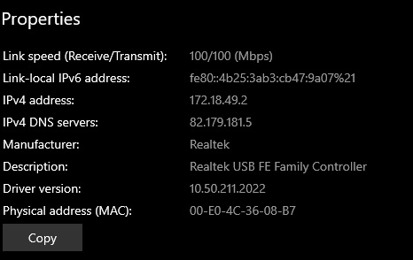

# Проверка подключения

Для проверки подключения к сети МИЭТ можно выполнить следующие шаги:
* убедиться в наличии IP адреса в подсети 172.18.0.0/16
* проверить доступность сайта users.miet.ru или miet.ru

## Пример для Android

## Пример на роутере

## Пример для Windows

## Когда подключение успешно

Если подключение осуществлено успешно, можно подключать Интернет.

Следующий шаг: [регистрация у провайдера](./5-reg.md).