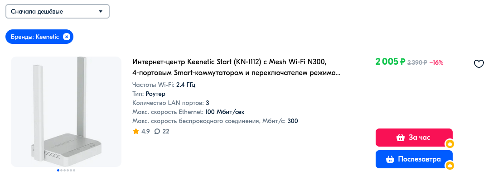
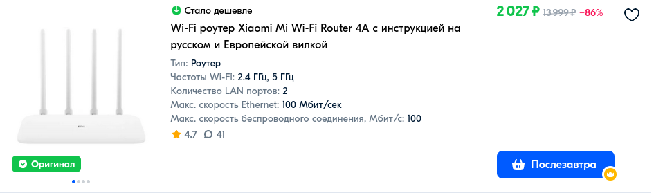
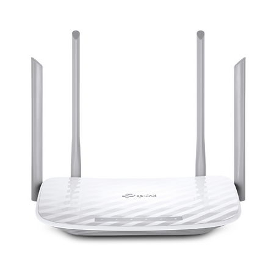
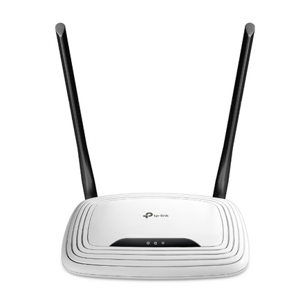
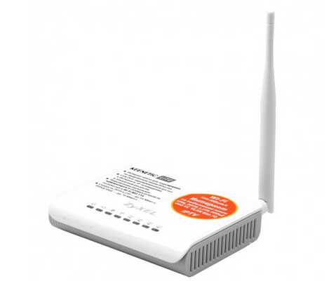
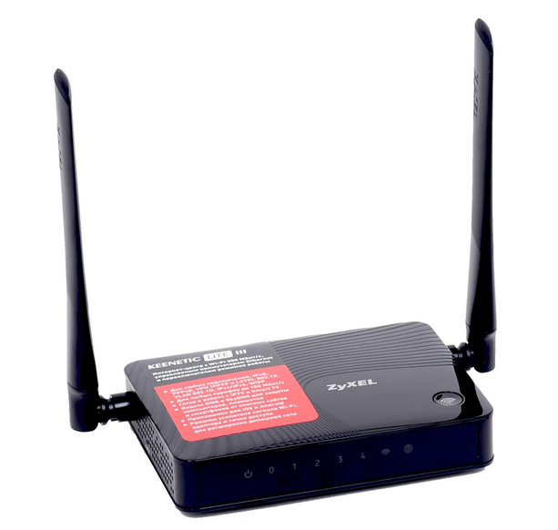

# Рекомендуемые к покупке роутеры

## Keenetic Start KN-1112

Плюсы:
* Удобный интерфейс
* Не нужно прошивать
* Не сбивается время при перезагрузке

Минусы:
* Однодиапазонный

Вывод: стоит покупать, если нужно "не заморачиваться"

## Xiaomi Mi Router 4A (R4AC)

Модельный номер: DVB4230GL (проверяйте это! китайские CN не подходят).

Плюсы:
* Двухдиапазонный
* Не сбивается время при перезагрузке
* Дешевый относительно остальных

Минусы:
* Требуется прошивка

Вывод: самое ходовое решение с двухдиапазонными роутерами, в силу того, что другие стали дороже.

## Keenetic Air KN-1613 (KN-1713)

Плюсы:
* Удобный интерфейс
* Работает из коробки
* Не сбивается время
* Диапазоны 2.4 ГГц и 5 ГГц

Минусы:
* Стоимость видели? камон..

Вывод: только если потом повезёшь на квартиру

## Xiaomi Mi Router 4C

Модельный номер: DVB4231GL.

Плюсы: 
* Можно найти за 1000р
* Не сбивается время

Минусы:
* Однодиапазонный
* Wi-Fi работает неоч, но для 2.4 ГГц в общаге все равно лучше не будет

Вывод: один из вариантов "подешевле", ну так

## Роутеры TP-Link

### Двухдиапазонные 

* TP-Link Archer A5
* TP-Link Archer C20V5
* TP-Link Archer C50V4

Вывод: предыдущее ходовое решение для двухдиапазонного роутера в общагу. Увы, сейчас стоят дороже разумного. Если найдете дешевле 2к - пишите, они огонь.

### Однодиапазонные

* TP-Link TL-WR 740 v4
* TP-Link TL-WR 740 v6
* TP-Link TL-WR 841 v8
* TP-Link TL-WR 841 v13
* TP-Link TL-WR 842 v1
* TP-Link TL-WR 842 v5
* TP-Link TL-WR 841 v14 (без GUI)

Вывод: эти все я прошивал. Многие из них еще послужат. При покупке до 1000р - идеально, если не нужна сверхскорость. Время не сбивается.

# Не рекомендуются к покупке
Старые роутеры Zyxel Keenetic (как на фото). Отличительный знак - брендированы Zyxel, имеются следы тараканов, ха-ха.

Минусы:
* Слетает время при отключении питания
* Старые, а значит высохшие кондеры в БП и периодические отключения
* Слабый процессор
* Слабый сигнал Wi-Fi

По сути, их можно брать, только если бесплатно или за 500 рублей.

# Заключение

Если вам повезло, вы стали владельцем одного из таких роутеров. Следующий шаг - [настройка](./4-setup.md).
