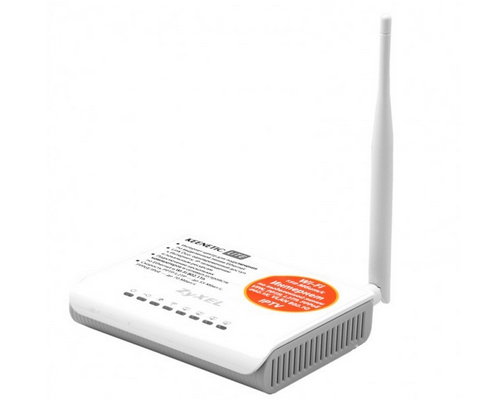
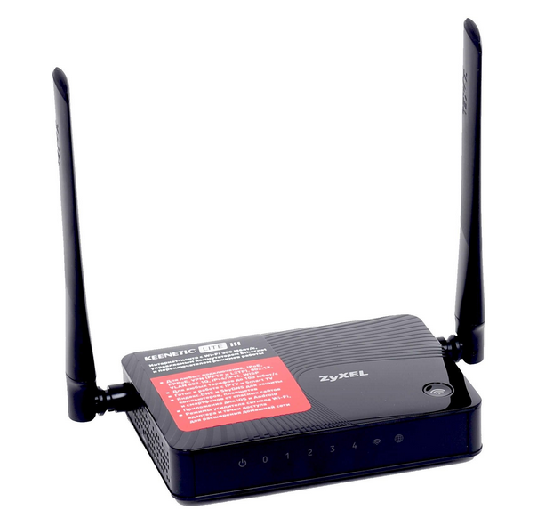

# Здесь нет, не было и не будет прошивок! Покупайте Keenetic.

# НОВЫЙ РОУТЕР ИЗ МАГАЗИНА

> [!Note]
> Роутеры Keenetic не требуют прошивки вообще и никогда

* Keenetic Start
* Keenetic Launcher
* Keenetic Carrier
* и все другие Keenetic/Netcraze

> [!CAUTION]
> другие роутеры не поддерживаются

## Б/У роутеры из студгородка

## 1. Роутеры б/у с 5 ГГц

Keenetic:
* Keenetic City
* Keenetic Air
* Keeneitc Extra

> [!Note]
> Роутеры Keenetic не требуют прошивки вообще и никогда

TP-Link:
* TP-Link Archer A5 v4
* TP-Link Archer A5 v5
* TP-Link Archer C20 v4
* TP-Link Archer C20 v5
* TP-Link Archer C50 v4
* TP-Link Archer C60 v3
* TP-Link Archer C6U v1
* TP-Link Archer C6 v2

> [!Note]
> Убедитесь, что на покупаемом вами с рук роутере стоит прошивка OpenWRT или Keenetic

Xiaomi:

* Xiaomi Mi Router 4A (R4AC)
* Xiaomi Mi Router 4A Gigabit Edition v2 (RB02) AC1200

> [!Note]
> Убедитесь, что на покупаемом вами с рук роутере стоит прошивка OpenWRT или Keenetic

## 2. Роутеры менее рекомендуемые, имеющие только один диапазон Wi-FI

Роутеры с поддержкой только диапазона 2.4 ГГц не могут развивать скорость более 40 Мбит/с на одно устройство даже при достаточном тарифе. Как правило, по проводу спокойно дают полную скорость тарифа.

* Keenetic Start
* Keenetic Giga
* Keenetic 4G
* Прочие Keenetic

> [!Note]
> Роутеры Keenetic не требуют прошивки вообще и никогда

* TP-Link TL-WR 740 v4
* TP-Link TL-WR 740 v6
* TP-Link TL-WR 840 v2 
* TP-Link TL-WR 841 v8
* TP-Link TL-WR 841 v9
* TP-Link TL-WR 841 v10
* TP-Link TL-WR 841 v11
* TP-Link TL-WR 841 v13
* TP-Link TL-WR 842 v1
* TP-Link TL-WR 842 v3
* TP-Link TL-WR 842 v5
* TP-Link TL-WR 841 v14 (настройка только через ssh)

* Xiaomi Mi Router 4C (R4CM)

> [!Note]
> Убедитесь, что на покупаемом вами с рук роутере стоит прошивка OpenWRT или Keenetic

# 3. Не рекомендуются к покупке

> [!WARNING]  
> Эти роутеры попьют вашу кровушку. Не стоит покупать их ни при каких условиях.

Старые роутеры Zyxel Keenetic (как на фото). Отличительный знак - брендированы Zyxel.

Имеют тенденцию отвратительно работать по 2.4 ГГц, некоторые задыхаются даже по проводу. При отключении питания требуется заново настраивать дату и время.

# Заключение

Если вам повезло, вы стали владельцем одного из поддерживаемых роутеров. Следующий шаг - [настройка](./4-setup.md).
