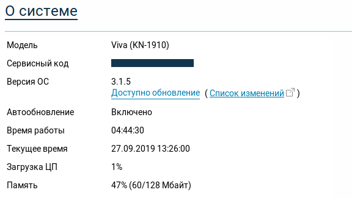
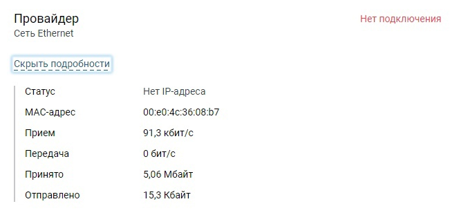

# Настройка роутера Keenetic

## Мастер настройки

При первом запуске роутера (или после сброса) вам будет предложено пройти мастер настройки. Для нас он бесполезен. "Для самостоятельной настройки интернет-центра перейдите в __панель управления__" - или кнопка "Выйти из мастера" - тут уже как повезет. Принимаем лицензионное, придумываем пароль администратора: лучше admin, чтобы не забыть. И вперед.

## Вход

Логинимся в админке 192.168.1.1 ([my.keenetic.net](http://my.keenetic.net))

## Интернет - проводной

Настраиваем как на скрине разделы:

* Настройка IPv4 (автоматическая DHCP)

### MAC адрес

* "По умолчанию" выбирается тогда, когда тариф к онплюсу не подключался, и вряд ли потребуется подключать компьютер напрямую.

* Если до этого было произведено подключение к ПК, и сейчас роутер подключен в то же самое гнездо Ethernet компьютера __по проводу__, то можно выбрать опцию "Взять с вашего ПК".

* Если подключение производилось с телефона или ПК через MIET-DP либо сейчас настройка производится не с проводного подключения либо с другого ноутбука, то выбираем опцию "Вручную". 

Мак компьютера можно посмотреть в настройках через свойства интерфейса. Или для десятки "Пуск - Параметры - Сеть и Интернет" (физический адрес вроде подписано).

И отсюда этот мак адрес пишем в роутер.

### Проверка подлинности

Сюда пишем логин пароль ОРИОКС (не от онплюса) и выбираем метод как на скрине.

Нажимаем "сохранить".

## Настройка даты и времени

Заходим в управление - системные настройки (скрин на русском потерялся)

Тут нас интересуют текущие дата и время.

Снимаем галочку "устанавливать время автоматически" и вбиваем ручками дату и время (ДД-ММ-ГГГГ ЧЧ:ММ:СС).

Нажимаем "сохранить".

## Настройка Wi-Fi

Настройка как на скрине, думаю тут понятно.

## Подключение

Далее можно подключить провод от провайдера или, если вы чините уже настроенное, перевоткнуть.

## Проверка

По большей части проверку можно осуществить на влкадке "Системный монитор".

Во-первых, при наличии подключенного кабеля должен гореть индикатор портов в разделе "Сетевые порты" (синий - провайдер, серые - локалка). В данном случае 100М Full Duplex, как и должно быть.

Далее имеет смысл удостовериться, что стоит сегодняшняя дата. (да, поновее скриншота под рукой не было)

Следующим этапом смотрим на статус подключения. 

Сразу раскрываем информацию на "подробнее". 

Если пишет "Проверьте кабель", возвращаемся на два шага назад. 

Если нет подключения и нет IP адреса, проверяем корректность введённых данных от ориокса.

Если выдан IP адрес вида 172.18.\*\*.\*\*, но роутер пишет "Без доступа в сеть", значит получен IP адрес, но к нему не привязан тариф.

Если пишет просто "Подключено", то победа.

Если интернета нет, но открывается Ориокс, то варианта два:

* Вы еще не подключили тариф, а значит сейчас всё хорошо, и есть смысл идти дальше - к регистрации у провайдера и подключению тарифа.
* Вы уже подключили интернет напрямую к компьютеру (или через вайфай, не важно) - значит был указан неверный MAC адрес, нужен именно MAC того устройства, которое было подключено с выходом в интернет.

[Следующий шаг: Проверка подключения](./3-check.md)