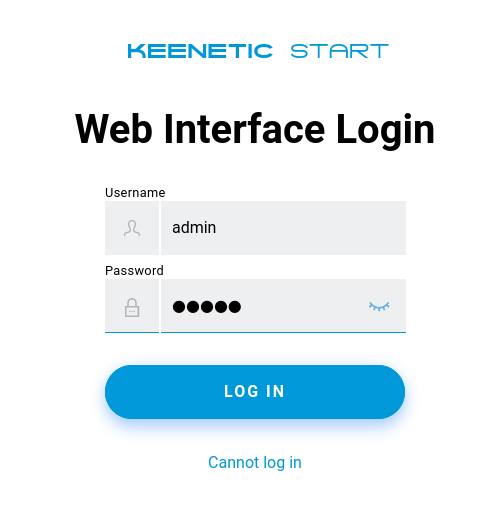
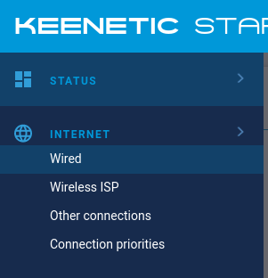
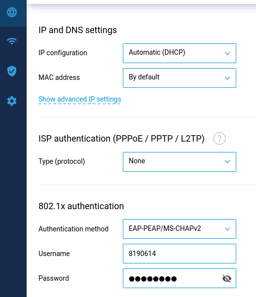
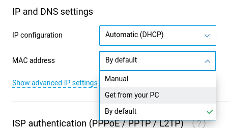
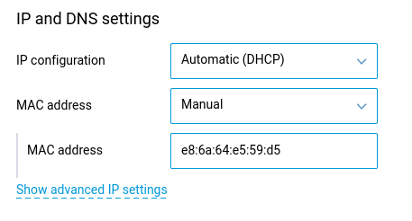
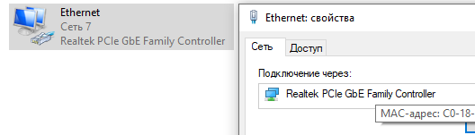
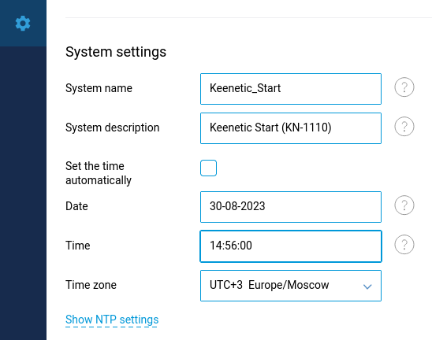
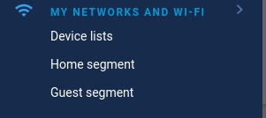
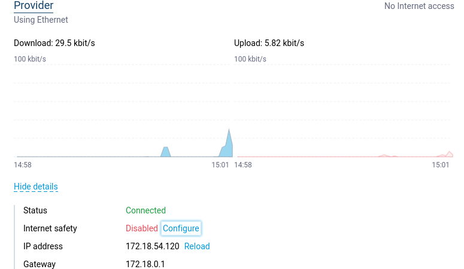

# Настройка роутера

# Keenetic

__Вход__

Логинимся в админке 192.168.1.1 ([my.keenetic.net](http://my.keenetic.net))

__Интернет - проводной__

В меню сбоку выбираем настройку проводного подключения.

Настраиваем как на скрине разделы:

* Получение ip адреса (динамически)
* Мак адрес (это уточним ниже)
* Подключение к провайдеру (нет)
* Авторизация по 802.1х (как на скрине, логин и пароль от ориокса)

__Про мак адрес__

Если уже был подключен интернет напрямую в комп без роутера, и _компьютер подключен к роутеру по проводу в тот же сетевой интерфейс_, то выбираем опцию "взять мак адрес с ПК". (если настраиваете с wi-fi, сделает фигню).

Если уже был подключен, но настройка производится с другого ПК или через wi-fi, то выбираем опцию "Вручную" и вбиваем туда мак адрес ручками.

Мак компьютера можно посмотреть в настройках через свойства интерфейса.

Нажимаем "сохранить".

__Настройка даты и времени__

Заходим в управление - системные настройки

Тут нас интересуют текущие дата и время.

Снимаем галочку "устанавливать время автоматически" и вбиваем ручками дату и время (ДД-ММ-ГГГГ ЧЧ:ММ:СС).

Нажимаем "сохранить".

__Настройка Wi-Fi__

Нужный скрин потерялся, короче здесь меняем исходные SSID и пароль точки доступа на нужные.

(Home segment / домашняя сеть)

__Подключение__

Далее можно подключить провод от провайдера или, если вы чините уже настроенное, перевоткнуть. 

__Как должно быть__

Если все сделали правильно, в дашборде будет выдан айпи. Иначе смотрите на статусные сообщения: не подключен кабель, не пройдена авторизация и тд.

[Следующий шаг: Проверка подключения](./3-check.md)