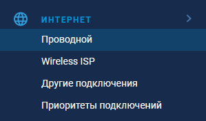
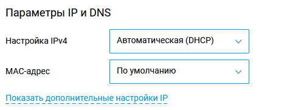
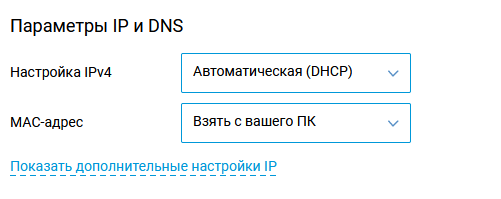
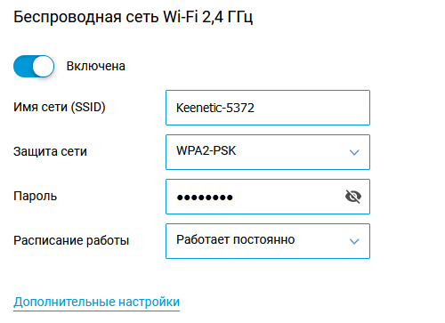

# Настройка роутера Keenetic

## Вход

Логинимся в админке 192.168.1.1 ([my.keenetic.net](http://my.keenetic.net))

## Интернет - проводной

Настраиваем как на скрине разделы:

__Настройка IPv4 (автоматическая DHCP)__

__MAC адрес__

Если в онплюсе еще не подключался тариф, можно оставить "По умолчанию", как на скрине выше.

Если до этого было произведено подключение к ПК, и сейчас роутер подключен в то же самое гнездо Ethernet компьютера __по проводу__, то можно выбрать опцию "Взять с вашего ПК".

Если подключение производилось с телефона или ПК через MIET-DP либо сейчас настройка производится не с проводного подключения либо с другого ноутбука, то выбираем опцию "Вручную". 

Мак компьютера можно посмотреть в настройках через свойства интерфейса. Или для десятки "Пуск - Параметры - Сеть и Интернет" (физический адрес вроде подписано).

Нажимаем "сохранить".

## Настройка даты и времени

Заходим в управление - системные настройки (скрин на русском потерялся)

Тут нас интересуют текущие дата и время.

Снимаем галочку "устанавливать время автоматически" и вбиваем ручками дату и время (ДД-ММ-ГГГГ ЧЧ:ММ:СС).

Нажимаем "сохранить".

## Настройка Wi-Fi

Настройка как на скрине, думаю тут понятно.

## Подключение

Далее можно подключить провод от провайдера или, если вы чините уже настроенное, перевоткнуть. 

На дашборде должно показывать, что подключен порт WAN (0). Иначе кабель мертвый.

__Как должно быть__

Если все сделали правильно, в дашборде будет выдан айпи. Иначе смотрите на статусные сообщения: не подключен кабель, не пройдена авторизация и тд.

[Следующий шаг: Проверка подключения](./3-check.md)