# Настройка роутера Keenetic

## Мастер настройки и сброс роутера

При настройке роутера полезным бывает сбросить его до заводских настроек. Это позволяет:
* подключиться к роутеру по Wi-Fi (при отсутствии lan разъема в ноутбуке) - сброс восстановит заводские параметры Wi-Fi, указанные на наклейке
* сбросить пароль администратора роутера
* удалить настройки предыдущих владельцев

При первом запуске роутера (или после сброса) вам будет предложено пройти мастер настройки. Возможно, браузер даже выведет для этого отдельное окно "Вы должны войти в эту сеть перед тем как сможете получить доступ в Интернет".

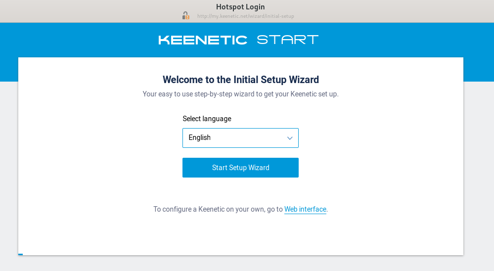

Здесь меняем язык на русский и переходим в "панель управления".

Принимаем лицензионное соглашение и задаем пароль.

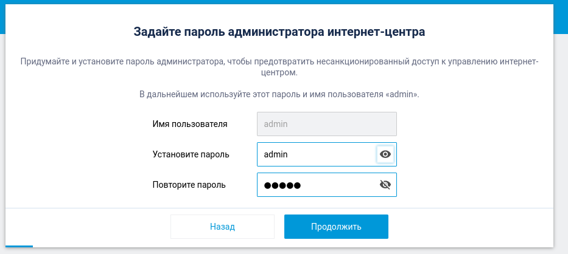

## Вход

Логинимся в админке 192.168.1.1 ([my.keenetic.net](http://my.keenetic.net))

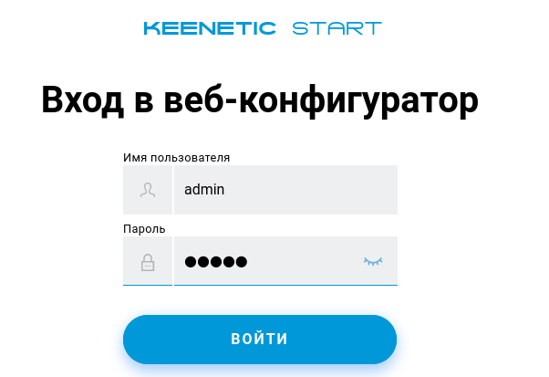

## Интернет - проводной

### MAC-адрес

__[Как узнать MAC адрес и какой мне нужен](./6-macaddr.md) - помощь__

Сначала мы меняем MAC-адрес устройства.

* "По умолчанию" выбирается тогда, когда тариф к онплюсу не подключался. Роутер будет авторизовываться со своим MAC-адресом.

* "Взять с вашего ПК" выбирается, если до этого подключен тариф, и настройка роутера производится с того компьютера, который использовался при проводном подключении напрямую. При этом важно, чтобы роутер был подключен к компьютеру в тот же lan разъем.

* "Вручную" MAC адрес вписывается в ситуациях, когда необходимо взять MAC с другого устройства - например, телефона, подключенного к MIET-DP, либо если роутер настраивается через Wi-Fi (в таком случае опция "взять с вашего ПК" будет брать мак с неправильного интерфейса).

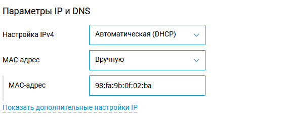

__[Как узнать MAC адрес и какой мне нужен](./6-macaddr.md) - помощь__

### Проверка подлинности

На этой же вкладке ниже мы меняем только раздел "Проверка подлинности". Здесь вбивается логин от Ориокс (номер на пропуске) и пароль. _Не нужно вписывать здесь пароль от онплюс_.

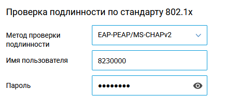

Нажимаем "сохранить".

## Настройка даты и времени

Заходим в управление - системные настройки (скрин на русском потерялся)

Тут нас интересуют текущие дата и время.

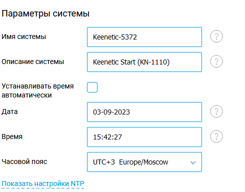

Снимаем галочку "устанавливать время автоматически" и вбиваем ручками дату и время (ДД-ММ-ГГГГ ЧЧ:ММ:СС).

Нажимаем "сохранить".

## Настройка Wi-Fi

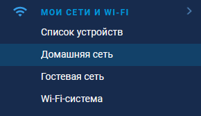

Настройка как на скрине, думаю тут понятно.

## Подключение

Далее можно подключить провод от провайдера или, если вы чините уже настроенное, перевоткнуть.

## Проверка

По большей части проверку можно осуществить на влкадке "Системный монитор".

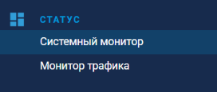

Во-первых, необходимо убедиться в исправности кабеля от провайдера. От этого может сообщить статус "Проверьте кабель".

Чуть ниже на вкладке "Системный монитор" также можно видеть статус всех разъемов роутера:

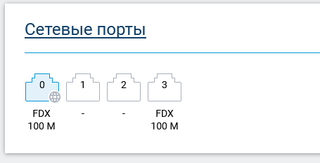

Здесь видно, что подключен провод провайдера и один из разъемов локальной сети. 

__[Как найти провод от провайдера и определить рабочий](./6-wire.md) - помощь__

Далее имеет смысл удостовериться, что стоит сегодняшняя дата и время. С временем из прошлого века роутер не подключится.

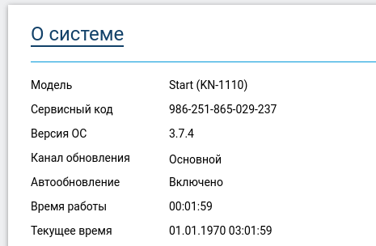

Следующим этапом смотрим на статус подключения. 

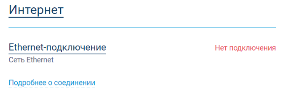

Сразу раскрываем информацию на "подробнее". 

Если пишет "Проверьте кабель", возвращаемся на два шага назад. 

Если нет подключения и нет IP адреса, проверяем корректность введённых данных от ориокса.

Если выдан IP адрес вида 172.18.\*\*.\*\*, но роутер пишет "Без доступа в сеть", значит получен IP адрес, но к нему не привязан тариф.

Если пишет просто "Подключено", то победа.

Если интернета нет, но открывается Ориокс, то варианта два:

* Вы еще не подключили тариф, а значит сейчас всё хорошо, и есть смысл идти дальше - к регистрации у провайдера и подключению тарифа.
* Вы уже подключили интернет напрямую к компьютеру (или через вайфай, не важно) - значит был указан неверный MAC адрес, нужен именно MAC того устройства, которое было подключено с выходом в интернет.

[Следующий шаг: Проверка подключения](./3-check.md)