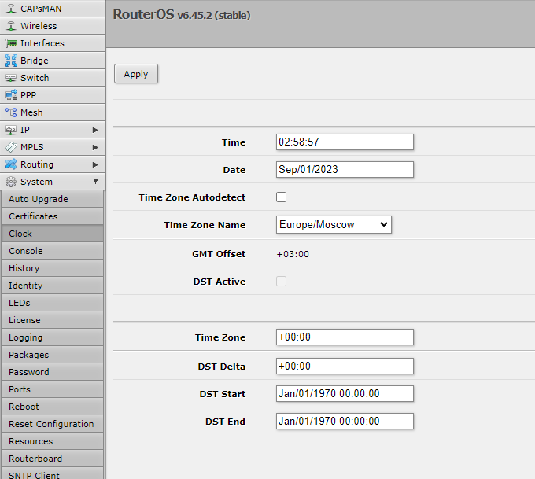
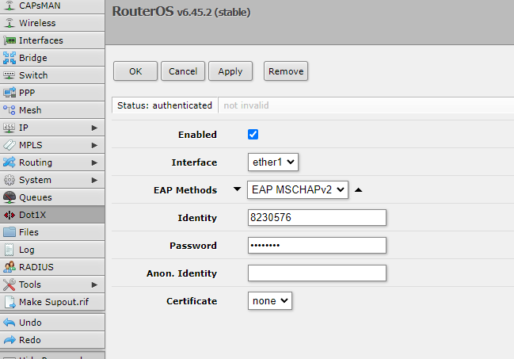
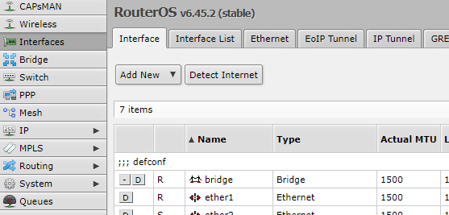
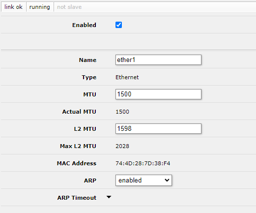

# Настройка роутера mikrotik

> [!IMPORTANT]  
> Перед настройкой требуется отключить провод провайдера от роутера и компьютера. На компьютере нужно отключить Проверку подлинности, если она была настроена.

Сделано на mikrotik rb951ui-2nd а вообще хз, оно должно быть везде одинаково. Dot1x модуль может быть выпилен из более новых прошивок RouterOS и поставляться с доп.пакетами - тут нужно смотреть.

__Тут будет немногословно, сопоставляйте с гайдами на другие роутеры, чтобы было понятно что и зачем.__

## Настройка даты и времени

System - Clock. Date в формате Month/DD/YYYY.
Время как обычно.

## Настройка 802.1х

Dot1X

короче просто как на скрине

## Настройка интерфейса Ethernet

Interfaces - ether1 (пронумерованы на торце).

Здесь по идее по-дефолту, меняется только мак адрес если надо. Еще мак адрес можно поменять на старнице быстрой настройки.

__[Как узнать MAC адрес и какой мне нужен](./6-macaddr.md) - помощь__

__[Как найти провод от провайдера и определить рабочий](./6-wire.md) - помощь__

## Настройка Wi-Fi и мак адреса

Проще всего на Quick Set, слева вайфай, справа мак адрес. Там же будет написан IP адрес выданный. 

[Следующий шаг: Проверка подключения](./3-check.md)
