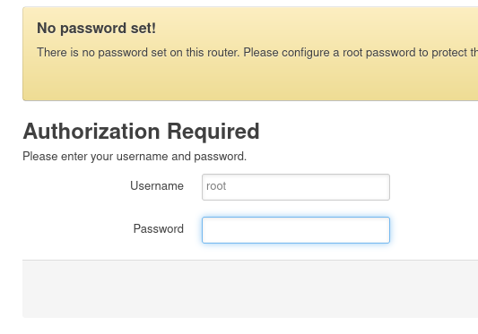
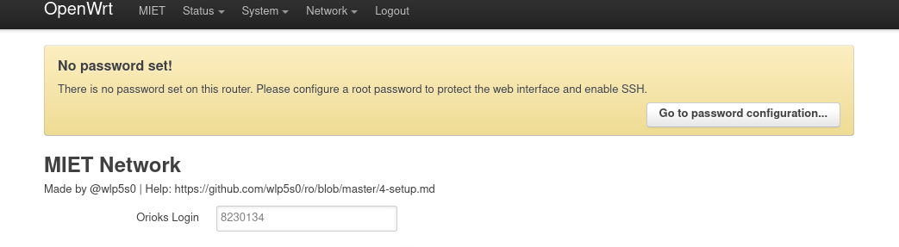
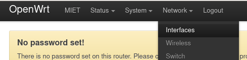
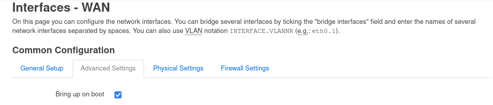
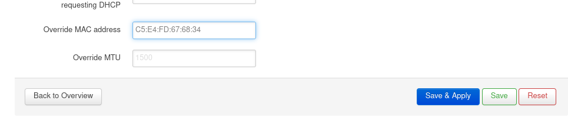
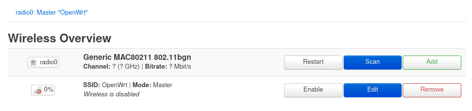
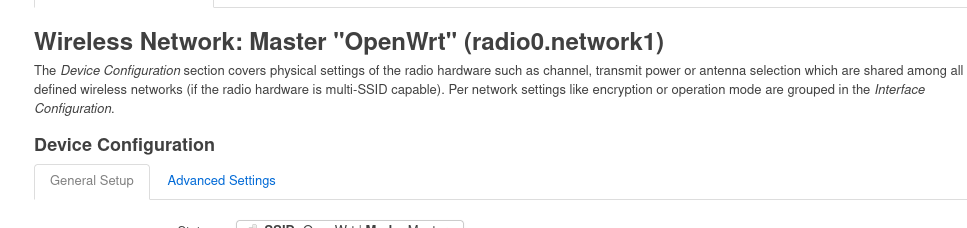
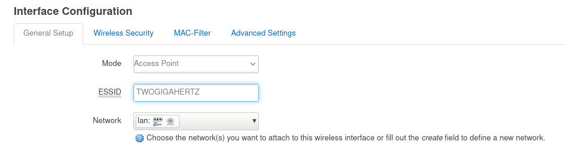
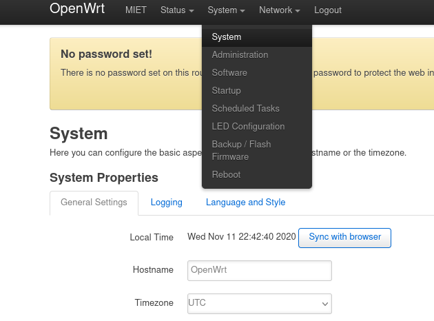
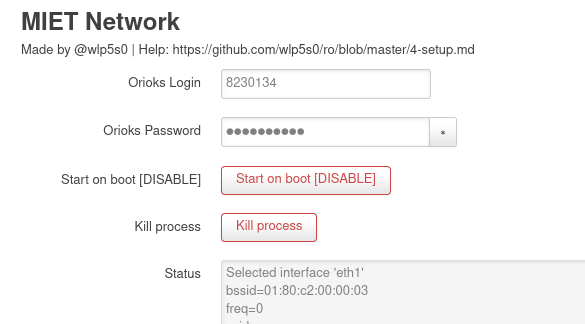

# Настройка роутера на OpenWRT

Настройка роутеров с прошивкой OpenWRT и маломощным железом. Это роутеры с OpenWRT версий 18, 19 и более ранними. Как правило, однодиапазонные TP-Link.

## 1. Вход в WEB-интерфейс

Настройка производится в WEB-интерфейсе роутера, доступном без подключения к интернету. 

Для этого подключаем роутер к ПК по проводу либо по Wi-Fi, если сеть уже настроена. В браузере в адресной строке необходимо открыть адрес `http://192.168.1.1/` либо `http://openwrt.lan/`. 

Аккаунт `root` без пароля. Позднее его можно установить на вкладке System - Administration.

Интерфейс LuCI для ОС OpenWRT на маломощных роутерах выглядит так или схожим образом.

## 2. Подмена MAC адреса

__[Как узнать MAC адрес и какой мне нужен](./6-macaddr.md) - помощь__

Подмена MAC-адреса интерфейса WAN осуществляется в случае, **если ранее производилось подключение** с другого устройства - через проводное подключение с настройкой проверки подлинности либо беспроводную сеть MIET-DP. **Иначе этот шаг можно пропустить.**

В интерфейсе переходим на вкладку Network - Interfaces.

Нас интересует строчка с интерфейсом WAN. Переходим в настройки интерфейса нажатием на `Edit`.

Откроется окно с настройкой интерфейса WAN, на котором выбираем Advanced Settings.

Внизу будет параметр `Override MAC address`.

Узнаём MAC адрес устройства, на котором ранее осуществлялось подключение.

__[Как узнать MAC адрес и какой мне нужен](./6-macaddr.md) - помощь__

Вписываем этот MAC-адрес на место поля `Override MAC address`, как указано на скриншоте.

Применяем настройки, нажав Save & Apply.

## 3. Настройка Wi-Fi

Переходим на страницу __Network - Wireless__.

Здесь представлен интерфейс radio0 и созданная под ним сеть OpenWRT. Редактируем её нажатием на Edit.

Откроется окно редактирования сети.

В нижней половине в разделе Interface Configuration доступны параметры точки доступа. Здесь мы редактируем:

__3.1. Название сети__

Параметр ESSID в General Setup отвечает за название сетию

__3.2. Пароль и шифрование сети__

Указываем Encryption `WPA2-PSK` и пароль для точки доступа в Key.

__3.3. Применение настроек__

Можно сразу включить сеть нажав на Enable в верхней половине:

Либо нажать Save&Apply, затем нажать Enable на общем экране, там, где была синяя Edit.

## 4. Настройка времени

На вкладке System – System нажимаем Sync with browser рядом с полем текущего времени. Оно может отличаться от системного на 3 часа, как правило, не играет роли. Достаточно, чтобы совпадала дата.

Точно так же сохраняем настройки через Save & Apply.

## 5. Настройка авторизации в сети МИЭТ
На вкладке MIET (в ранних версиях модуля – Interfaces – mschapv2) устанавливаем логин и пароль от ОРИОКС.
Сохраняем кнопкой Save.

__Start on boot [Disable]__ отвечает за автозапуск сервиса авторизации при включении роутера, должен быть красным.

__Kill process__ позволяет отключить или запустить сервис авторизации вручную.

__Заметка__. Если любое действие на вкладке выпадает в ошибку, это старая версия модуля и настраивается ручками [по инструкции, раздел 802.1x](./4-setup-owrt-cli.md), а вообще стоит обратиться к автору гита для обновления на прошивку с починенным багом.

## 6. Перезагрузка

Чтобы все норм заработало, перезагружаем роутер.

## Диагностика

Заходим на вкладку 192.168.1.1 Network - Interfaces. Смотрим на WAN.

__На интерфейсе RX: 0 B (0 Pkts)__ - провод не подключен или неисправен. 
[Как найти провод от провайдера и определить рабочий](./6-wire.md). Еще можно проверять статус через Network - Switch, там отображается статус портов.

**На интерфейсе RX и TX больше 0**, но не появляются строки Uptime и IPv4. Значит нужно проверить:

* Дату (system system)
* Корректность введённых данных в MIET (mschapv2).
* Включенность сервиса авторизации там же (кнопки красные).
* Логи авторизации там же (о них чуть ниже)

< /p>

**На интерфейсе есть IPv4**

Ура!

* Если вы еще не подключали тариф, то всё хорошо, и есть смысл идти дальше - к регистрации у провайдера и подключению тарифа. Ориокс загрузится уже сейчас.
* Если тариф подключался, но сейчас интернета нет - указан неверный MAC адрес.
* Если тариф подключался, и интернет есть - всё тоже отлично.

## Про логи на вкладке MIET

Если `Selected interface 'global'`, то сервис авторизации не запущен. Для этого стоит убедиться, что кнопки на владке MIET красные, а если зеленые - запустить.

Если `Selected interface 'eth0.2'` то смотрим:

    EAP state=SUCCESS - всё хорошо
    EAP state=IDLE - безуспешно пытается авторизоваться
    EAP state=FAILURE - все точно плохо

## Нестандартные случаи

Авторизация на владке MIET успешна, IPv4 не появляется:
* либо лежат сервера миэта
* либо попробуйте с учеткой соседа
* либо пишите в онплюс они умеют это чинить

[Следующий шаг: Проверка подключения](./3-check.md)