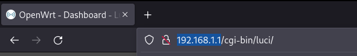

# Настройка роутера на OpenWRT

Настройка роутеров с прошивкой OpenWRT с наиболее современным интерфейсом. Как правило, двухдиапазонные роутеры. TP-Link, Xiaomi и др.

## 1. Вход в WEB-интерфейс

Настройка производится в WEB-интерфейсе роутера, доступном без подключения к интернету. 

Для этого подключаем роутер к ПК по проводу либо по Wi-Fi, если сеть уже настроена. В браузере в адресной строке необходимо открыть адрес `http://192.168.1.1/` либо `http://openwrt.lan/`. 

Аккаунт `root` без пароля. Позднее его можно установить на вкладке System - Administration.

Интерфейс LuCI для ОС OpenWRT последних версий выглядит следующим образом.

## 2. Подмена MAC адреса

__[Как узнать MAC адрес и какой мне нужен](./6-macaddr.md) - помощь__

Подмена MAC-адреса интерфейса WAN осуществляется в случае, **если ранее производилось подключение** с другого устройства - через проводное подключение с настройкой проверки подлинности либо беспроводную сеть MIET-DP. **Иначе этот шаг можно пропустить.**

В интерфейсе переходим на вкладку Network - Interfaces.
На этой вкладке выбираем подраздел Devices.

Находим строчку eht0.2 (либо в редких случаях eth1). Нажимаем на Configure.

Узнаём MAC адрес устройства, на котором ранее осуществлялось подключение.

__[Как узнать MAC адрес и какой мне нужен](./6-macaddr.md) - помощь__

Вписываем его в позицию `MAC address`.

Применяем настройки, нажав Save, затем Save & Apply.

## Настройки интерфейса WAN

Как правило, здесь ничего трогать не нужно - DHCP стоит по умолчанию. __Статический IP прописывать не нужно, не заработает__.

## 3. Настройка Wi-Fi

Переходим на страницу __Network - Wireless__.

Если роутер однодиапазонный, будет доступна только сеть 2.4 ГГц с радиомодулем radio0. Если двухдиапазонный, будет еще radio1, отвечающий за 5 ГГц.

__Сначала настроим 2.4 ГГц сеть (radio0)__

Нажимаем Edit напротив сети, у которой изначально название OpenWrt. 

Настройки производим в разделе Interface Configuration (нижняя половина всплывающего окна).

__3.1. General Setup (здесь устанавливается название сети ESSID)__

__3.2. Wireless Security (меняем пароль key и ставим шифрование WPA2-PSK)__

Сохраняем настройки в окне настройки сети: Save. Под интерфейсом будет указано: `Interface has x pending changes`. Это означает, что настройки будут применены после нажатия Save&Apply.

Можно нажать на Save&Apply внизу страницы либо продолжить настройку точки доступа 5 ГГц.

__Настройки для 5 ГГц (radio1) чуть сложнее__

Здесь мы так же задаём название и пароль сети, однако для корректного функционирования выбора каналов 5 ГГц мы должны выбрать регион работы роутера.

Выбираем сеть под модулем `radio1`, также жмём Edit.

__3.3. General Setup (здесь устанавливается название сети ESSID)__

__3.4. Wireless Security (меняем пароль key и ставим шифрование WPA2-PSK)__

__3.5. Advanced Settings в Device Configuration__

Здесь необходимо выставить Contry Code `RU`. Можно открыть выпадающий список и напечатать на клавиатуре RU, тогда сразу выберется нужный регион.

Теперь нужно сохранить настройки через Save.

Теперь применяем все настройки (для 2.4 ГГц и 5 ГГц диапазонов), нажав Save&Apply.

Теперь код региона и параметры сетей должны примениться.

__3.6. General Setup в Device Configuration__

Снова открываем для редактирования точку доступа диапазона 5 ГГц (под `radio1`). Edit. 

Настройки в разделе General Setup в верхней половине. Выбираем здесь канал для работы 5 ГГц через выпадающее меню. 

Save, Save & Apply.

__3.7. Включение точек доступа__

Теперь можно включить обе сети, нажимая Enable рядом с Edit.

Точка доступа будет активирована.

Стоит обратить, что на 5 ГГц будет стоять выбранный нами канал.

__Вот так это будет выглядеть с уже подключенными клиентами:__

## 4. Настройка времени

На вкладке System – System нажимаем Sync with browser рядом с полем текущего времени. Оно может отличаться от системного на 3 часа, как правило, не играет роли. Достаточно, чтобы совпадала дата.

Точно так же Save & Apply.

## 5. Настройка авторизации в сети МИЭТ
На вкладке MIET (в ранних версиях модуля – Interfaces – mschapv2) устанавливаем логин и пароль от ОРИОКС.
Сохраняем кнопкой Save.

__Disable/Enable__ отвечает за автозапуск сервиса при включении

__Stop/Start__ отвечает за запуск службы авторизации в настоящее время

__Заметка__. Если любое действие на вкладке выпадает в ошибку, это старая версия модуля и придется ручками [по инструкции, раздел 802.1x](./4-setup-owrt-cli.md) либо обратиться к автору гита для обновления на прошивку с починенным багом.

## 6. Перезагрузка

Чтобы все норм заработало, перезагружаем роутер.

## Диагностика

Заходим на вкладку 192.168.1.1 Network - Interfaces. Смотрим на WAN.

__На интерфейсе RX: 0 B (0 Pkts)__ - провод не подключен или неисправен. 
[Как найти провод от провайдера и определить рабочий](./6-wire.md). Еще можно проверять статус через Network - Switch, там отображается статус портов.

**На интерфейсе RX и TX больше 0**, но не появляются строки Uptime и IPv4. Значит нужно проверить:

* Дату (system system)
* Корректность введённых данных в MIET (mschapv2).
* Включенность сервиса авторизации там же (кнопки красные).
* Логи авторизации там же (о них чуть ниже)

< /p>

**На интерфейсе есть IPv4**

Ура!

* Если вы еще не подключали тариф, то всё хорошо, и есть смысл идти дальше - к регистрации у провайдера и подключению тарифа. Ориокс загрузится уже сейчас.
* Если тариф подключался, но сейчас интернета нет - указан неверный MAC адрес.
* Если тариф подключался, и интернет есть - всё тоже отлично.

## Про логи на вкладке MIET

Если `Selected interface 'global'`, то сервис авторизации не запущен. Для этого стоит убедиться, что кнопки на владке MIET красные, а если зеленые - запустить.

Если `Selected interface 'eth0.2'` то смотрим:

    EAP state=SUCCESS - всё хорошо
    EAP state=IDLE - безуспешно пытается авторизоваться
    EAP state=FAILURE - все точно плохо

## Нестандартные случаи

Авторизация на владке MIET успешна, IPv4 не появляется:
* либо лежат сервера миэта
* либо попробуйте с учеткой соседа
* либо пишите в онплюс они умеют это чинить

[Следующий шаг: Проверка подключения](./3-check.md)