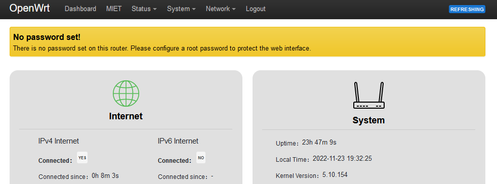
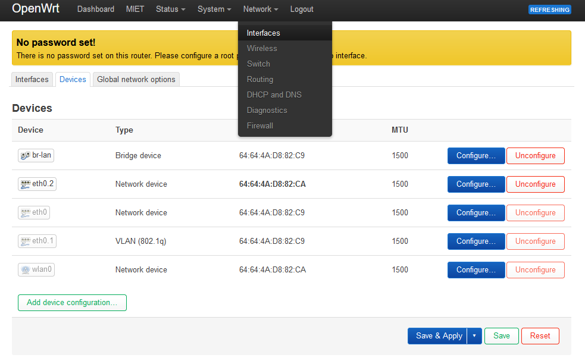
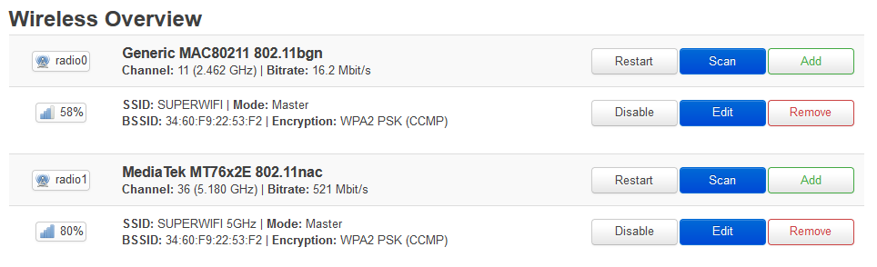
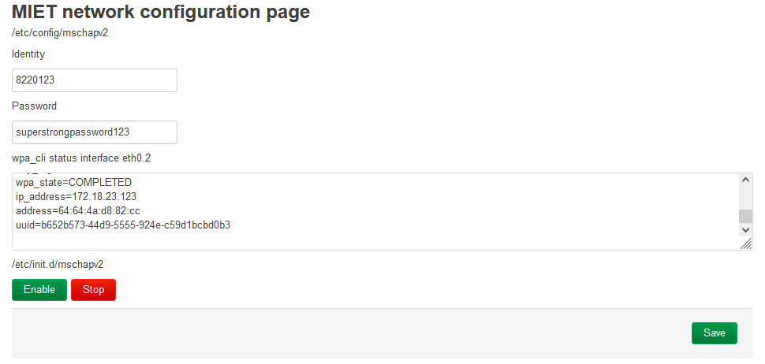

# Настройка роутера

## OpenWRT (TP-Link, Xiaomi)

Подключаетесь к роутеру по вайфаю или проводу. Заходите на 192.168.1.1.

__1. Установка MAC адреса (если до этого подключались с провода)__

Если это первое подключение, MAC адрес подменять не нужно.
В интерфейсе переходим на вкладку Network - Interfaces.
Там подвкладка Devices. Выбираем eht0.2 (либо в редких случаях eth1). Нажимаем на Configure.

Смотрим на MAC, который был на компьютере, использованном для первоначальной настройки роутера.

Вписываем его на место существующего MAC адреса.

Save, затем Save & Apply.

__Заметка:__ в ранних версиях OpenWRT подвкладки Devices нет и подмена MAC производится прямо в подвкладке Interfaces, на интерфейсе WAN:

__2. Настройки интерфейса WAN__

Как правило, здесь ничего трогать не нужно - DHCP стоит по умолчанию. __Статический IP прописывать не нужно, не заработает__.

__3. Настройка Wi-Fi__

Переходим на страницу Network - Wireless. По умолчанию Wi-Fi в прошивке выключен. Нам доступны radio0 – 2.4 ГГц модем и radio1 – 5 ГГц модем (если роутер двухдиапазонный).
Рядом с названием радиомодуля нажимаем Add, конфигурируем точку доступа следующим образом (см скрины). Устанавливаем ESSID, на вкладке Wireless Security устанавливаем шифрование WPA2-PSK.

Аналогично настраиваем 5 ГГц.

После сохранения включаем точки доступа (Enable). Если все устройства поддерживают 5 ГГц, то включать 2.4 ГГц не обязательно.

__4. Настройка времени__

На вкладке System – System нажимаем Sync with browser рядом с полем текущего времени. Оно может отличаться от системного на 3 часа, как правило, не играет роли. Достаточно, чтобы совпадала дата.

Точно так же Save & Apply.

__5. Настройка авторизации в сети МИЭТ__
На вкладке MIET (в ранних версиях модуля – Interfaces – mschapv2) устанавливаем логин и пароль от ОРИОКС.
Сохраняем кнопкой Save.

Включаем автозапуск скрипта кнопкой Enable.

__6. Перезагрузка__

Чтобы все норм заработало, перезагружаем роутер.

[Следующий шаг: Проверка подключения](./3-check.md)