# Настройка роутера OpenWRT (TP-Link, Xiaomi)

Подключаетесь к роутеру по вайфаю или проводу. Заходите на 192.168.1.1.

## Подмена MAC адреса (если ранее был подключен без роутера)

__[Как узнать MAC адрес и какой мне нужен](./6-macaddr.md) - помощь__

В интерфейсе переходим на вкладку Network - Interfaces.
Там подвкладка Devices.

Выбираем eht0.2 (либо в редких случаях eth1). Нажимаем на Configure.

Смотрим на MAC, который был на компьютере, использованном для первоначальной настройки роутера. 

Вписываем его на место существующего MAC адреса.

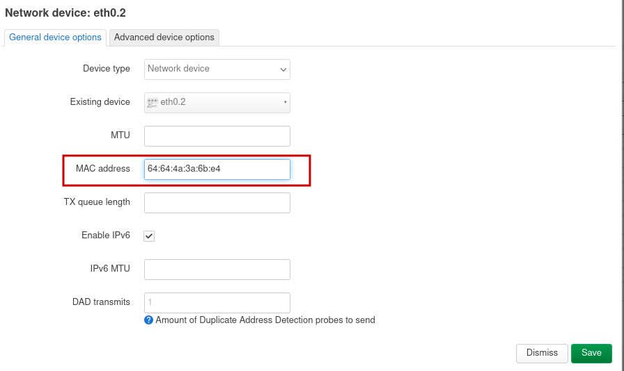

Save, затем Save & Apply.

__Заметка:__ в ранних версиях OpenWRT подвкладки Devices нет и подмена MAC производится прямо в подвкладке Interfaces, на интерфейсе WAN:

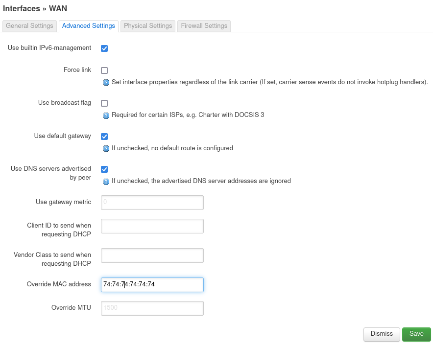

## Настройки интерфейса WAN

Как правило, здесь ничего трогать не нужно - DHCP стоит по умолчанию. __Статический IP прописывать не нужно, не заработает__.

## Настройка Wi-Fi

Переходим на страницу Network - Wireless.

По умолчанию Wi-Fi в прошивке выключен.

Нам доступны radio0 – 2.4 ГГц модем и radio1 – 5 ГГц модем (если роутер двухдиапазонный). При каждом из них выключенные ненастроенные точки доступа с названием OpenWRT. Каждую из них редактируем через Edit.

__Сначала настроим 2.4 ГГц сеть (radio0)__

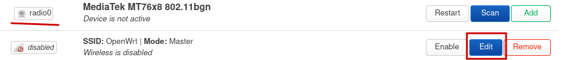

Нажимаем Edit напротив сети, у которой изначально название OpenWrt. Раздел General Setup можно пока не трогать, меняем в разделе Interface Configuration. Здесь можно ручками выставить канал 2.4 ГГц.

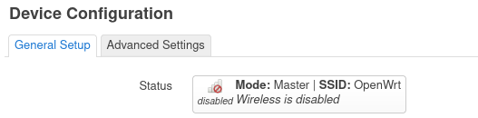

__1. General Setup (тут меняем SSID)__

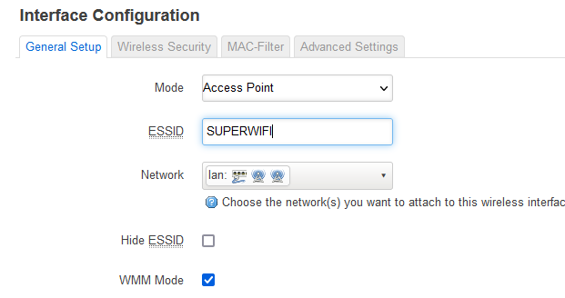

__2. Wireless Security (тут пароль и шифрование)__

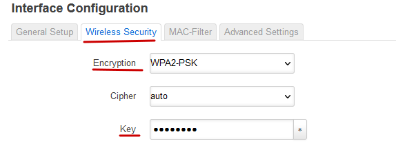

Сохраняем настройки: Save. Можно сразу нажать Enable выше, и сеть автоматически применит настройки и включится. 

__Настройки для 5 ГГц (radio1) чуть сложнее__

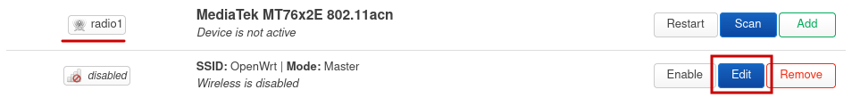

__3. General Setup (тут меняем SSID)__

__4. Wireless Security (тут пароль и шифрование)__

__5. Advanced Settings в Device Configuration__
Здесь необходимо выставить Contry Code RU

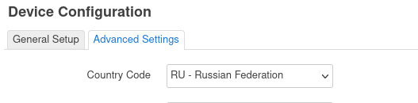

Теперь нужно сохранить настройки через Save и затем Save&Apply. Но на этом мы не закончили.

Завершающим элементом будет выбрать вручную канал, на котором мы будем работать. Списки доступных каналов меняются не сразу, а после применения кода страны. Поэтому возвращаемся в настройки 5 ГГц Wi-Fi.

__6. General Setup в Device Configuration__

И выбираем здесь канал для работы 5 ГГц. Только после установки кода страны они будут работать все, а не только 36.

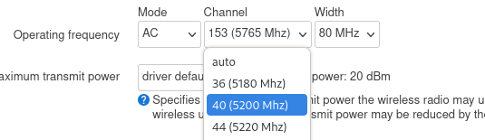

Дальше можно сохранять и включать сеть.

__Вот так это будет выглядеть__

После сохранения включаем точки доступа (Enable). Если все устройства поддерживают 5 ГГц, то включать 2.4 ГГц не обязательно.

## Настройка времени

На вкладке System – System нажимаем Sync with browser рядом с полем текущего времени. Оно может отличаться от системного на 3 часа, как правило, не играет роли. Достаточно, чтобы совпадала дата.

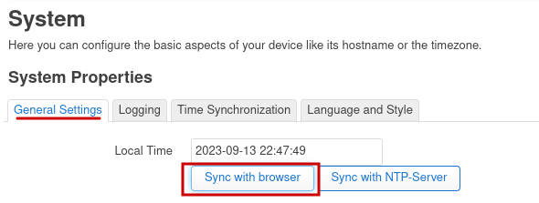

Точно так же Save & Apply.

## Настройка авторизации в сети МИЭТ
На вкладке MIET (в ранних версиях модуля – Interfaces – mschapv2) устанавливаем логин и пароль от ОРИОКС.
Сохраняем кнопкой Save.

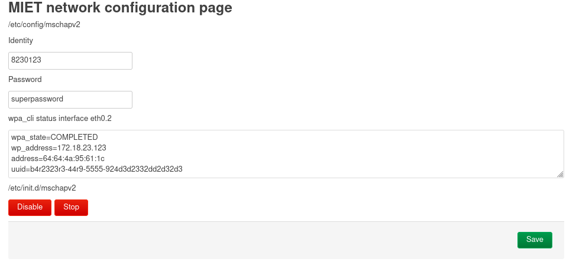

На вкладке имеются кнопки Enable/Disable и Start/Stop, отвечающие за автоматический-при-включении и ручной соответственно запуск сервиса авторизации. Корректное состояние - обе включены (красные). Если зеленые, включаем.

__Заметка__. Если любое действие на вкладке выпадает в ошибку, это старая версия модуля и придется ручками [по инструкции, раздел 802.1x](./4-setup-owrt-cli.md).

__Про логи__.
На вкладке присутствует поле, выводящее результат команды wpa_cli. На нём можно видеть статус авторизации и присвоенный ip адрес. Полезно при диагностике.

__6. Перезагрузка__

Чтобы все норм заработало, перезагружаем роутер.

## Диагностика

Заходим на вкладку 192.168.1.1 Network - Interfaces. Смотрим на WAN.

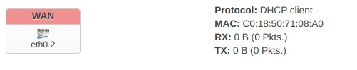

__На интерфейсе RX: 0 B (0 Pkts)__ - провод не подключен или неисправен. 
[Как найти провод от провайдера и определить рабочий](./6-wire.md). Еще можно проверять статус через Network - Switch, там отображается статус портов.

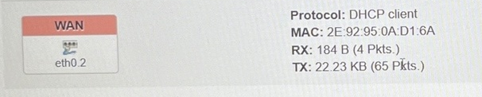

**На интерфейсе RX и TX больше 0**, но не появляются строки Uptime и IPv4. Значит нужно проверить:

* Дату (system system)
* Корректность введённых данных в MIET (mschapv2).
* Включенность сервиса авторизации там же (кнопки красные).
* Логи авторизации там же (о них чуть ниже)

< /p>

**На интерфейсе есть IPv4**

Ура!

* Если вы еще не подключали тариф, то всё хорошо, и есть смысл идти дальше - к регистрации у провайдера и подключению тарифа. Ориокс загрузится уже сейчас.
* Если тариф подключался, но сейчас интернета нет - указан неверный MAC адрес.
* Если тариф подключался, и интернет есть - всё тоже отлично.

## Про логи на вкладке MIET

Если `Selected interface 'global'`, то сервис авторизации не запущен. Для этого стоит убедиться, что кнопки на владке MIET красные, а если зеленые - запустить.

Если `Selected interface 'eth0.2'` то смотрим:

    EAP state=SUCCESS - всё хорошо
    EAP state=IDLE - безуспешно пытается авторизоваться
    EAP state=FAILURE - все точно плохо

## Нестандартные случаи

Авторизация на владке MIET успешна, IPv4 не появляется:
* либо лежат сервера миэта
* либо попробуйте с учеткой соседа
* либо пишите в онплюс они умеют это чинить

[Следующий шаг: Проверка подключения](./3-check.md)