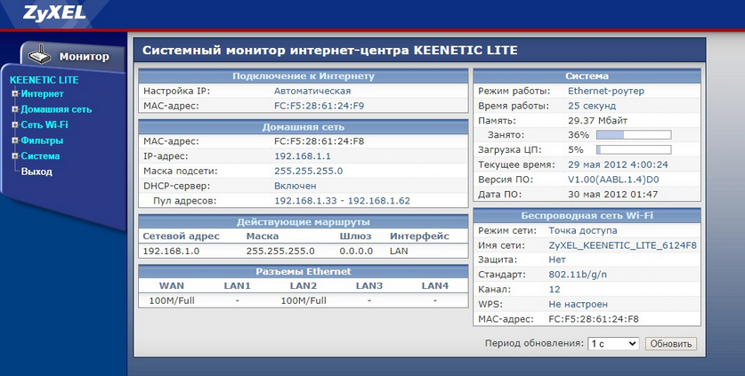
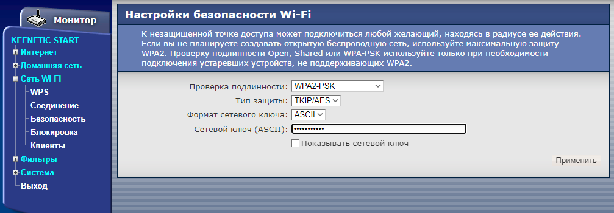
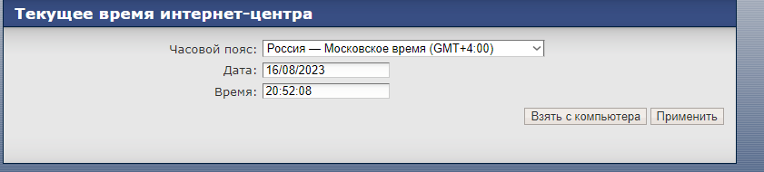
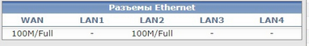
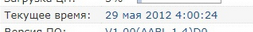
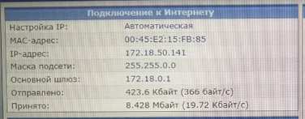

# Настройка роутера Zyxel Keenetic (старые)

> [!IMPORTANT]  
> Перед настройкой требуется отключить провод провайдера от роутера и компьютера. На компьютере нужно отключить Проверку подлинности, если она была настроена.

Подключаетесь на 192.168.1.1

Заходите в админку (обычно admin / 1234)

## Интернет - Подключение

__[Как узнать MAC адрес и какой мне нужен](./6-macaddr.md) - помощь__

Здесь подменяем мак адрес (Использовать MAC адрес) если нужно.

Использовать MAC-адрес - можно посмотреть в гайде для keenetic там такие же настройки.

## Интернет - Авторизация

Делаем как на скрине, логин и пароль - от ОРИОКСа

## Сеть Wi-Fi - Соединение

Здесь название сети

## Сеть Wi-Fi - Безопасность

Здесь пароль, настройки шифрования как на скрине

## Система - Дата и время

Снять галочку "автоматически синхр время". Применить

Затем ручками или кнопкой "взять с компьютера" поставить норм время

## Диагностика

Смотрим на вкладке Монитор

Во-первых, проверяем дату, чтобы стоял текущий год (после выключения питания сбрасывает на 2012-2013). Во-вторых, что провод подключен и роутер его видит (100M/Full на WAN).

 

Если это починено, дальше смотрим.

Если как на скрине и айпи выдан, живем. (или проверяем что айпи совпадает с разделом услуги и правильный ли мак адрес поставили).

Если айпи не выдан, проверяем учетку Ориокс.

[Следующий шаг: Проверка подключения](./3-check.md)

