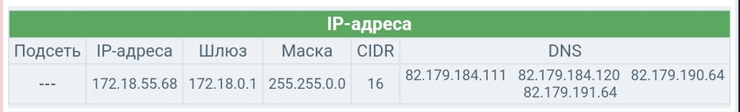

# Регистрация у провайдера

Переходим по ссылке "[Регистрация для студентов МИЭТ](https://stat.onplus.ru/miet)". 

Учетная запись МИЭТ вида 8230001. Сканы паспорта можно фотографиями. Окончанием регистрации является полученная sms с паролем к ЛК.

__Подключение тарифа__

Подключаем тариф на усмотрение, ставим галочку "Я уже подключен к проводной сети МИЭТ или планирую использовать беспроводное подключение".

__Оплачиваем__

Переходим в раздел "Оплата услуг" и тыкаем юкассу. Сумма любая, снимается раз в день.

__Статус услуг__

Полезно смотреть через раздел "Услуги" выданные IP адреса. Они должны совпадать с роутером или ПК. Если на роутере некорректный IP адрес, значит роутер использует MAC адрес, несовпадающий с MAC адресом в базе (ограничение провайдера на количество устройств с одной учетки).

Вроде раз в день сбрасываются после полуночи, если не тот телефон или комп подключили.

__Внимание!__ Никогда, слышите, никогда ручками не вбивайте все эти параметры, указанные на странице "Услуги", в ПК или роутер. IP адрес всегда выдается динамически. Оно здесь для проверки, не для настройки.
