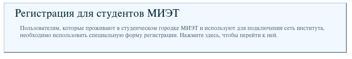
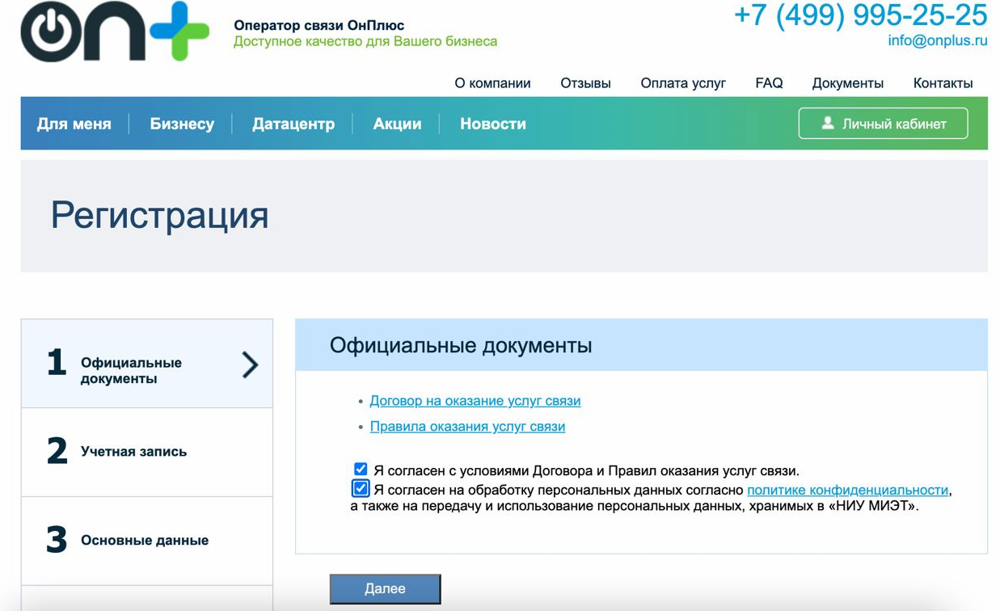
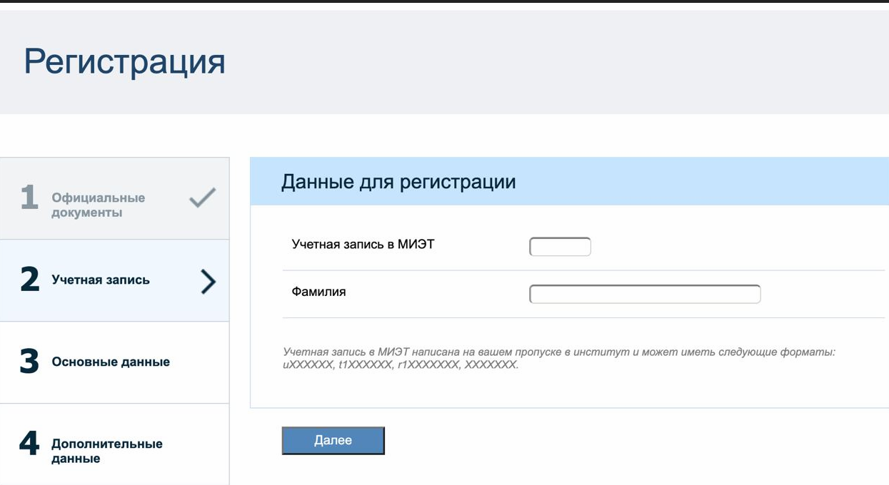
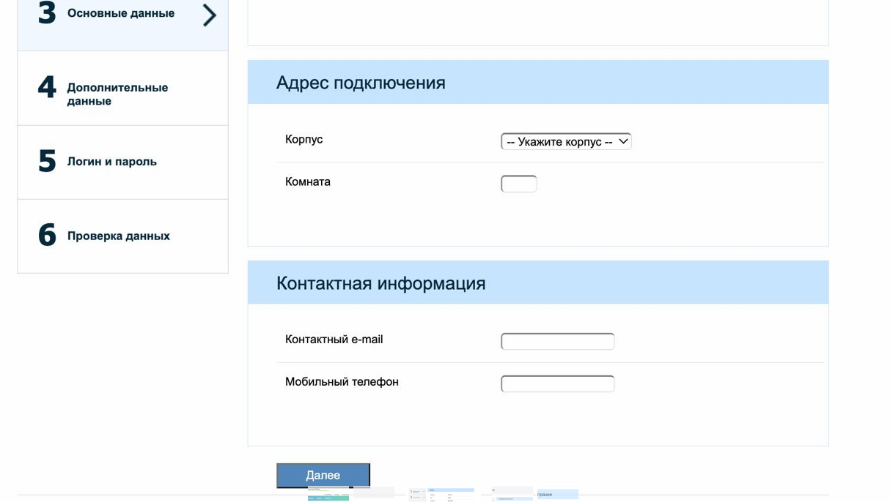
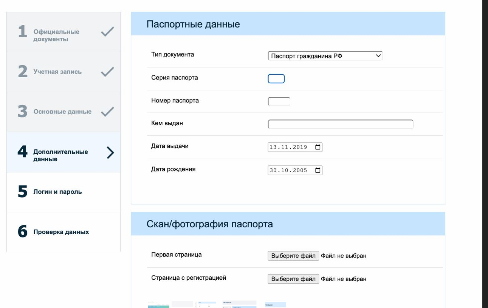
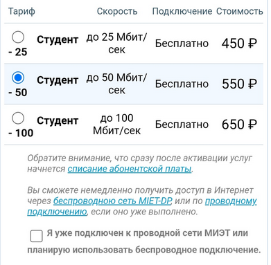
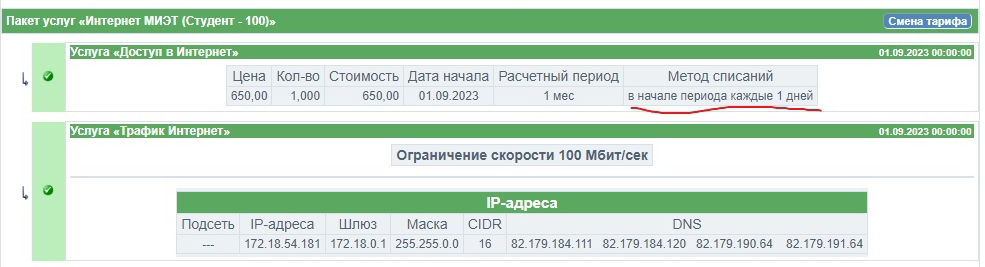

# Регистрация у провайдера

Переходим по ссылке "[Регистрация для студентов МИЭТ](https://stat.onplus.ru/miet)". 

Ставим обе галочки

Учетная запись МИЭТ вида 8230123, как на пропуске.

Оставляйте корректные емейл и номер, потому что на них будут приходить чеки и пароли.

Здесь данные как в паспорте. Регистрацию "на улице Юности" вписывать не нужно. Индекс почтовый по месту прописки/регистрации. Паспорт просто фотографируем.

Несколько раз нажимаем далее, оно будет просить подтверждать введенные данные. Разделы "Логин и пароль" и "Проверка данных" - их тоже нужно нажать "Далее". И только когда sms пришла, можно входить в личный кабинет онплюс.

__Подключение тарифа__

Выбираем в личном кабинете подключение услуги. Выбираем нужную скорость. Галочку "я уже подключен" ставим.

Будет окно "заявка принята в обработку", считайте, что всё уже принято.

__Оплачиваем__

Переходим в раздел "Оплата услуг" и тыкаем юкассу. Сумма любая, потому что провайдер снимает оплату каждый день, а не раз в месяц, что видно на скриншоте ниже.

__Статус услуг__

Полезно смотреть через раздел "Услуги" выданные IP адреса. Они должны совпадать с роутером или ПК. Если на роутере некорректный IP адрес, значит роутер использует MAC адрес, несовпадающий с MAC адресом в базе (ограничение провайдера на количество устройств с одной учетки).

Вроде раз в день сбрасываются после полуночи, если не тот телефон или комп подключили.

__Внимание!__ Никогда, слышите, никогда ручками не вбивайте все эти параметры, указанные на странице "Услуги", в ПК или роутер. IP адрес всегда выдается динамически. Оно здесь для проверки, не для настройки.