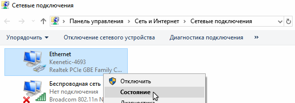
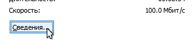
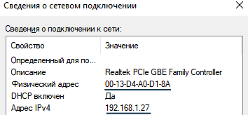
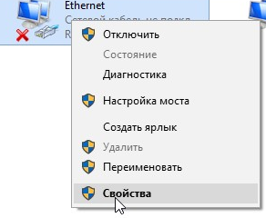
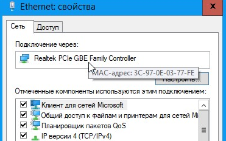
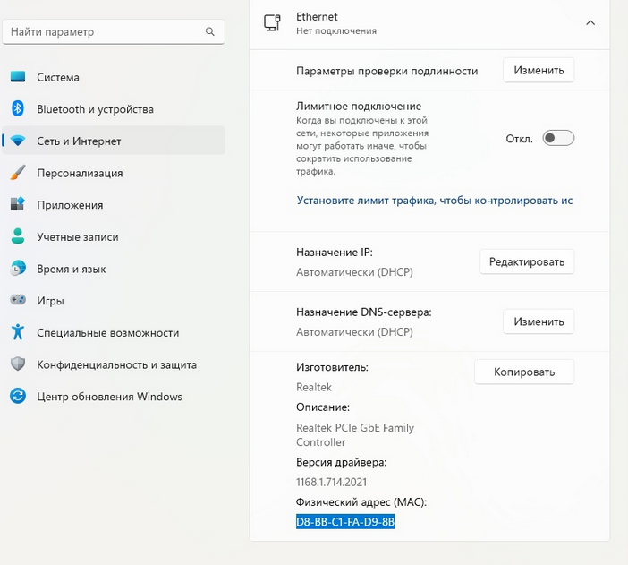

# Помощь - MAC адрес

Знать мак адрес устройства необходимо для правильной авторизации в сети МИЭТ. К мак адресу (физический адрес сетевого устройства) привязывается возможность использования тарифа с Интернетом у провайдера.

Далее рассмотрим, что делать с мак адресом в каждой из ситуаций.

## Я не подключал тариф

Можно взять мак адрес с любого из ноутбуков, который имеет Ethernet разъем, чтобы на него можно было вернуться при неисправности роутера.

## Я зарегистрировал тариф уже после того, как подключил роутер

В таком случае тариф привязан к тому мак адресу, который был вбит в роутер перед подключением. Либо это мак адрес роутера, либо тот, который указан в настройках роутера.

## Я подключил тариф на проводное подключение

В таком случае нужно узнать:

1. Название Ethernet адаптера, к которому подключен провайдер
2. Его MAC адрес в системе

Для этого в ОС Windows:

* В ОС Windows 7 нажмите "Пуск > Панель управления > Центр управления сетями и общим доступом > Изменение параметров адаптеров".
* В ОС Windows 10 нажмите "Пуск > Параметры > Панель управления > Сеть и Интернет > Центр управления сетями и общим доступом > Изменение параметров адаптеров".

Если адаптер используется, выбираем "Состояние", а там "Сведения".

Здесь можно видеть MAC адрес сетевой карты и выданный на данный момент IP адрес от провайдера. При переносе на роутер IP должен сохраниться.

Если адаптер выключен, нажимаем "Свойства".

Для MAC OS инструкция есть [на сайте Keenetic](https://help.keenetic.com/hc/ru/articles/214470965-%D0%9A%D0%B0%D0%BA-%D0%B2-Mac-OS-%D0%BF%D0%BE%D1%81%D0%BC%D0%BE%D1%82%D1%80%D0%B5%D1%82%D1%8C-%D0%BD%D0%B0%D1%81%D1%82%D1%80%D0%BE%D0%B9%D0%BA%D0%B8-%D1%81%D0%B5%D1%82%D0%B5%D0%B2%D0%BE%D0%B9-%D0%BA%D0%B0%D1%80%D1%82%D1%8B-IP-%D0%B0%D0%B4%D1%80%D0%B5%D1%81-MAC-%D0%B0%D0%B4%D1%80%D0%B5%D1%81-%D0%BC%D0%B0%D1%81%D0%BA%D1%83-%D1%88%D0%BB%D1%8E%D0%B7-).

Для винды 10 и 11 можно еще через "Пуск" - "Параметры" - "Сеть и Интернет".

## Я подключил тариф через Wi-Fi MIET DP

В случае ПК инструкции аналогичные, только смотрим для "Беспроводная сеть". 

Если подключали с телефона, смотрим либо через Настройки - Сети - Wi-Fi - "MIET DP" - сведения о подключении (когда выбрали рандомизированный MAC адрес) либо через Настройки - О телефоне - Физический адрес Wi-Fi, если выбрали MAC устройства.

