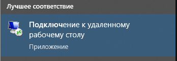
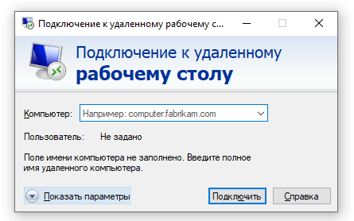
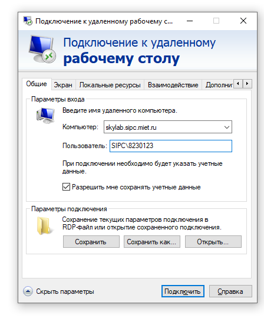
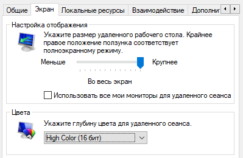
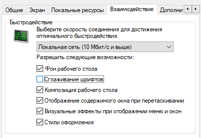
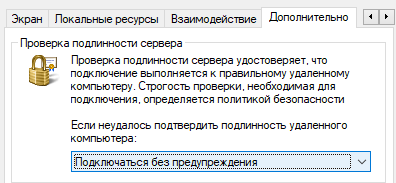
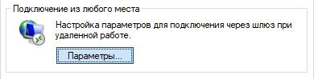
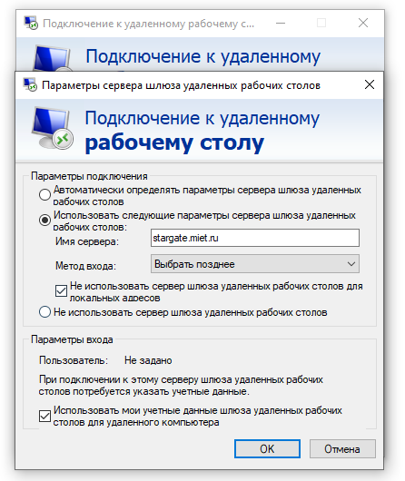
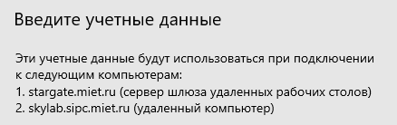

# Подключение к серверу удаленного рабочего стола

Институт предоставляет доступ к удаленным ПК на Windows с предустановленным софтом для работы. Также это один из вариантов передачи файлов из локальной сети института на домашний компьютер.

Выполните в пуске поиск программы "Подключение к удаленному рабочему столу".

Раскрываем "показать параметры"

Сюда вбиваем учётку ОРИОКС в виде `SIPC\823$$$$` и ставим галочку "разрешить мне сохранять учётные данные". Отсюда можно сохранить ярлык как .rdp файл.

Дальше настраиваем подвкладки: Экран

Взаимодействие

Дополнительно

Дополнительно - подключение из любого места - Параметры

Параметры шлюза:

Имя сервера: stargate.miet.ru, "Не использовать сервер шлюза..." и "Использовать мои учётные данные шлюза...". Ок.

Подключаемся

Вводим туда пароль от ОРИОКС и.. ничего не работает.

короче хз я буду разбираться