# Помощь - найти провод

Для подключения в комнате нужно найти провод от провайдера.

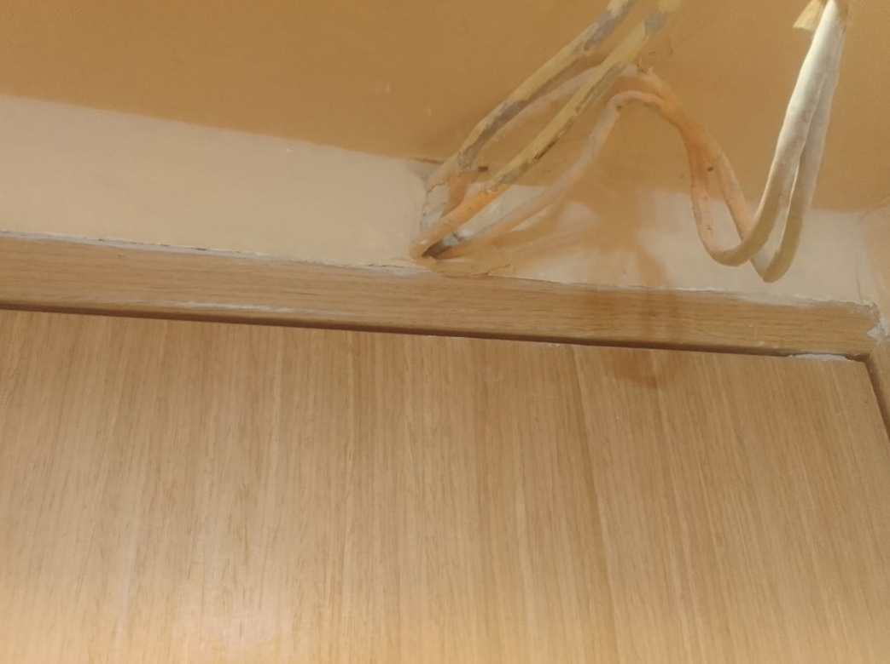
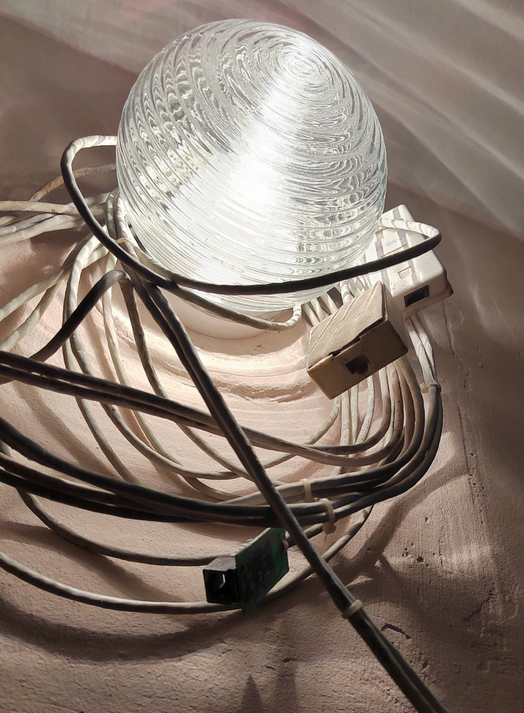
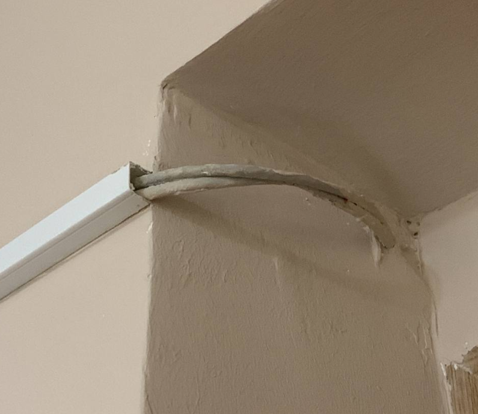
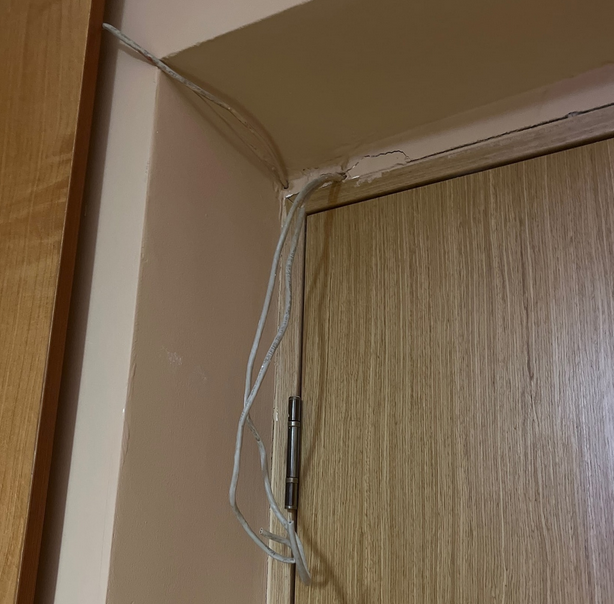

Как правило, это провода, торчащие из дверного косяка. Далее они могут быть обмотаны вокруг светильника над дверью, закинуты на шкаф, за шкаф, под шкаф, либо аккуратно убраны в кабель-канал.

Наша задача - найти их конец.

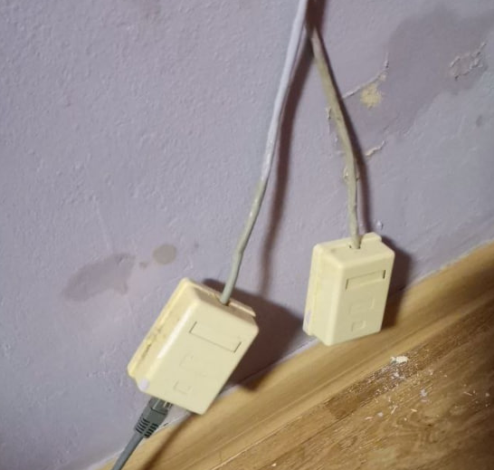
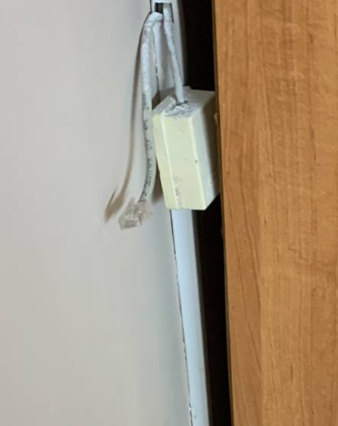

Окончанием кабеля будет так называемая LAN розетка - коробочка с разъемом под патч-корд. Изредка они обжаты сразу под разъем. Периодически их еще и обрезают под корешок - это вообще беда.

Далее нас интересует найти патч-корд. Это кабель витая пара, обжатый с каждой стороны разъемами 8p8c (RJ45). Они часто валяются на шкафах, в шкафах, под кроватями и также иногда замурованы в кабель-каналы. Иногда их приходится покупать новые.

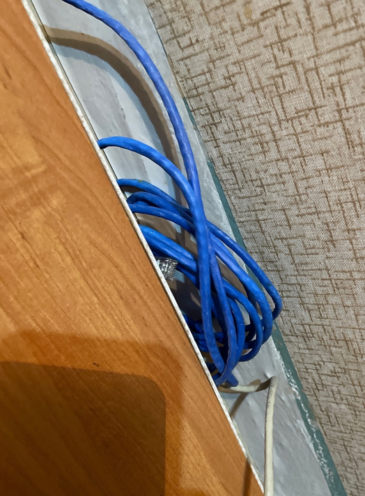
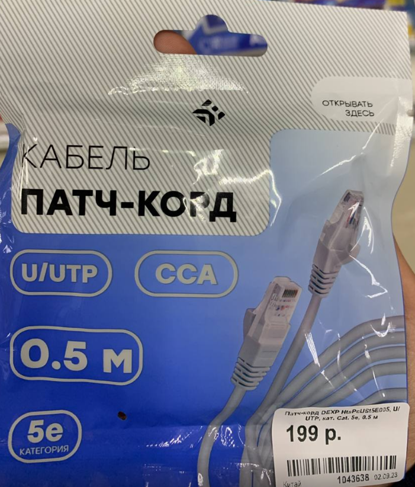
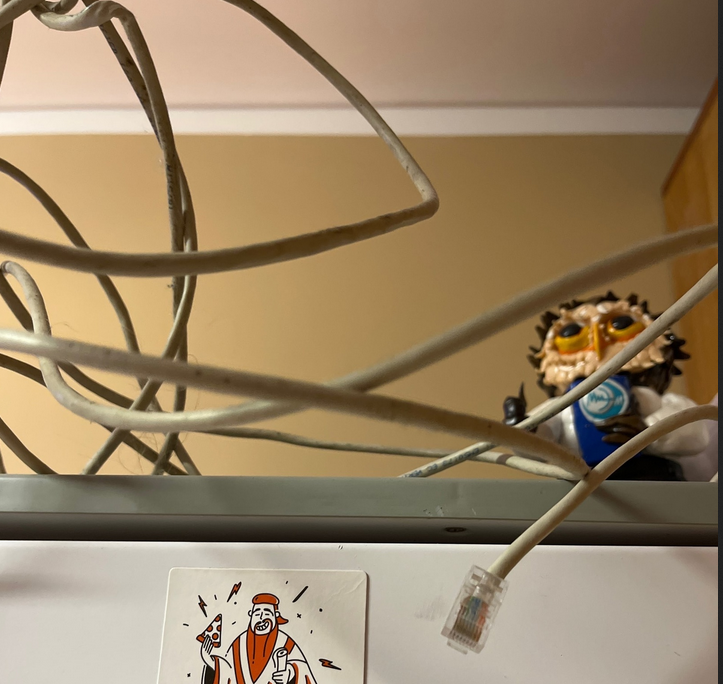
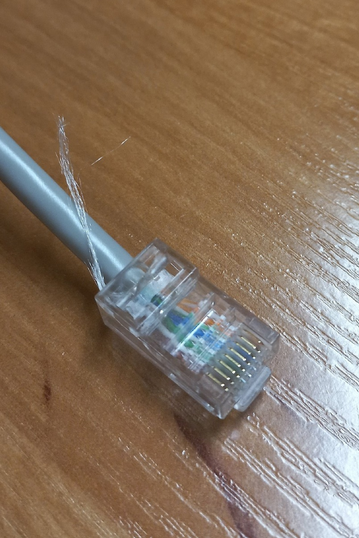

Итак, мы имеем патчкорд и розетку. Думали, всё? Ага, щас. Нужно найти рабочую.

В Windows 7 зайдите в меню "Пуск > Панель управления > Центр управления сетями и общим доступом".

В ОС Windows 10 нажмите "Пуск > Параметры > Панель управления > Сеть и Интернет > Центр управления сетями и общим доступом > Изменение параметров адаптеров".

Подключаем патчкорд в Ethernet разъем на ноутбуке либо USB Ethernet сетевую карту и смотрим статус разъема. Если "Неопознанная сеть" (или уже подключили проверку подлинности - и тогда  "Подключено") - то всё супер. Если разъем не шевелится, то всё плохо.

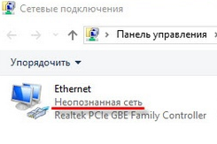